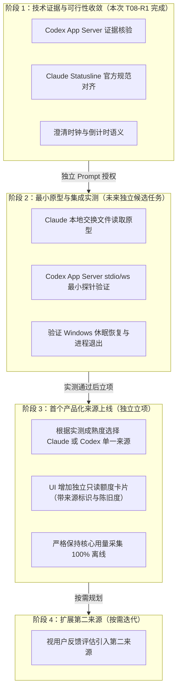

# Claude / Codex 账户额度与重置时间监控可行性研究（T08-R1 修订版）

- **报告编号**：T08-FEASIBILITY-20260907-R1
- **修订版本**：R1（补充 Codex 官方 App Server 协议一手证据、Claude Statusline 官方规范，修正过窄断言与契约设计）
- **基线**：HEAD `a7e887d` 上包含 T07 的未提交工作树，manifest 仍为 `0.3.0`。
- **审校修订日期**：2026-09-08；保留 R1 编号，不代表独立复审或 Windows 验收通过。
- **研究范围**：调研在 Coding Agent Monitor (CAM) 中增加 Claude 与 OpenAI/Codex 的“账户套餐额度与重置时间”监控的可行性
- **执行原则**：纯研究与文档规范，不修改生产代码，不连接真实账户，不读取本地私有凭据，优先一手官方文档与公开开源实现

---

## 1. 执行摘要与核心决策

### 1.1 总体结论概览

| 目标服务 | 综合裁决 | 核心依据与演进结论 |
| :--- | :--- | :--- |
| **OpenAI / Codex** | **CONDITIONAL GO<br>（官方 App Server 协议支持；需前置验证 Windows 进程与连接生命周期）** | **从原 R0 版的“绝对 NO-GO”修订**：根据官方开发者文档，Codex 官方客户端提供了基于 JSON-RPC 风格消息 的 `codex app-server` 接口，支持纯状态读取方法 `account/rateLimits/read` 及事件推送 `account/rateLimits/updated`，包含 `usedPercent`、`windowDurationMins`、`resetsAt` 及多桶信息；**无需模型推理，不消耗 Token**。CAM 无需直接读取凭据，认证由官方 Codex CLI 会话持有。但该方案需要本地运行官方 app-server 子进程或连接监听端口，在 Windows 上的进程管理、生命周期与环境依赖仍需实测。其余直连 API/网页爬虫仍维持 NO-GO。 |
| **Anthropic / Claude** | **CONDITIONAL GO<br>（被动本地状态导入可行；私有 OAuth 端点维持高风险暂缓）** | **精细分级三种不同路径**：<br>1. **官方 Statusline / 自定义交换文件（候选偏好，工程风险待验证）**：官方文档已将 `rate_limits`（`five_hour`、`seven_day`、`spend_limit`）作为正式字段规范，CAM 通过只读消费本地状态文件即可完全与凭据和网络解耦；<br>2. **私有 OAuth 端点（HIGH 风险，暂缓）**：社区实现需 OAuth Token，许可与生命周期未验证，按保守策略暂缓。 |

### 1.2 逐服务逐来源能力矩阵与证据等级

> **证据等级说明**：
> - **L1（一手官方正式标准）**：官方开发者文档、官方 OpenAPI 规范、已发布协议定义；
> - **L2（一手产品运行实现/挂钩）**：官方发布版 CLI/工具的实际行为、官方公开输入输出管道规范；
> - **L3（社区实现）**：可追溯源码，不代表官方规范或 CAM 验收（如 Claude-Code-Usage-Monitor）；
> - **L4（风险推断/非公开逆向假设）**：非公开私有接口、逆向尝试或缺乏官方 SLA 的推断。

| 服务 | 来源编号与名称 | 官方支持度 | 网络依赖 | 凭据接触 | 账户识别 | Windows 可行性 | 维护脆弱性 | 证据等级 | 裁决结论 |
| :--- | :--- | :--- | :--- | :--- | :--- | :--- | :--- | :--- | :--- |
| **Codex** | X1: 官方 App Server JSON-RPC (`account/rateLimits/read`) | 官方正式标准 | 本地 IPC (CLI 自行联网) | **CAM 零凭据接触** (由 CLI 持有) | 需 CLI 登录态 | 待验证 (stdio / ws) | 中 (依赖本地 Codex CLI 环境) | L1 | **CONDITIONAL GO** (候选首选) |
| **Codex** | X2: 官方 Org Costs/Usage API | 官方标准 | 联网 (只读) | **需 Admin Key** | Org / Project | 良好 | 低 | L1 | **NO-GO** (仅历史账单与静态上限) |
| **Codex** | X3: 推理 API 响应头 (`x-ratelimit-*`) | 官方标准 | 联网 (付费调用) | 需 API Key | 单一 Key | 良好 | 低 | L1 | **NO-GO** (无只读查询，仅微观流控) |
| **Codex** | X4: 历史 Billing Credit API | 当前可用性未核验 | 联网 | Session / Key | 混淆 | 未验证 | 未验证 | L4 | **NO-GO** (本次不采用，撤回全局废弃断言) |
| **Codex** | X5: ChatGPT 网页接口逆向 | 本项目不采用；许可未核验 | 联网 (逆向) | 需 Session Token | 单一 Cookie | 差 (对抗 Cloudflare) | 极高 (协议易损与风控风险) | L4 | **NO-GO** (严禁采用) |
| **Codex** | X6: 本地会话日志解析 (ccusage) | 官方/成熟实现 | 完全离线 | 无凭据接触 | 会话维度 | 良好 (已实现) | 低 | L1/L3 | **NO-GO** (实时权威来源不成立，分层见 §3.2) |
| **Claude** | C1: 官方 Statusline 管道拦截 | 官方正式标准 | 本地 (无网络) | **CAM 零凭据接触** | 弱 (跟随前台会话) | 良好 (需规避反斜杠转义) | 低-中 (依赖 CLI 前台交互刷新) | L1/L2 | **CONDITIONAL GO** (推荐被动导入) |
| **Claude** | C2: CAM 本地状态交换文件 | CAM 架构解耦 | 完全离线 | **CAM 零凭据接触** | 由外部写入 | 待验证 (文件只读监听) | 待验证 (自定义协议) | L4 | **CONDITIONAL GO** (架构偏好) |
| **Claude** | C3: 内部未公开 OAuth Usage 端点 | 未公开/实验性 | 联网 (主动) | **需读取本地 OAuth Token** | 单一当前登录 | 良好 (HTTP) | 高 (保守策略；运行风险未验证) | L3/L4 | **CONDITIONAL GO** (高风险暂缓) |
| **Claude** | C4: 官方推理 API 响应头 | 官方标准 | 联网 (付费调用) | 需 API Key | 单一 Key | 良好 | 低 | L1 | **NO-GO** (无只读探测，仅并发流控) |
| **Claude** | C5: claude.ai 网页逆向抓取 | 本项目不采用；许可未核验 | 联网 (爬虫) | 需 Session Cookie | 易混淆 | 差 (易被 CF 拦截) | 极高 (协议易损与风控风险) | L4 | **NO-GO** (严禁采用) |
| **Claude** | C6: 本地 JSONL 日志解析 | 官方格式 | 完全离线 | 无凭据接触 | 区分 project | 良好 (已实现) | 低 | L1/L3 | **NO-GO** (未核验可靠额度来源，不断言字段不存在) |

---

## 2. 核心概念严格消歧

在用量与额度监控领域，存在多个易混淆的数字概念。未来任何设计与实现必须严格区分下列 5 种指标，**绝不能相互替代或静默推导**：

```text
┌────────────────────────────────────────────────────────────────────────────────────────┐
│                                    概念层次与数据属性划分                               │
├───────────────────────┬────────────────────────┬───────────────────┬───────────────────┤
│ 概念名称              │ 物理实体与来源         │ 计量单位          │ 刷新与时效特征    │
├───────────────────────┼────────────────────────┼───────────────────┼───────────────────┤
│ 1. 本机 Token         │ 本地日志/DB (ccusage)  │ Tokens (整数)     │ 本地发生，事实累加│
│ 2. 按 API 估算成本    │ 本机 Token × 离线单价  │ USD (估算浮点)    │ 离线参考，非实际扣费│
│ 3. 账户套餐额度       │ 服务端订阅规则动态配额 │ % (百分比 0-100)  │ 滑动窗口计算，非线性│
│ 4. 预充值余额 Credits │ 官方账单预付充值金额   │ USD / 次数        │ 实时随扣费减少    │
│ 5. 采样后的重置时间   │ 服务端滑动/周期窗口点  │ Unix Epoch 时间戳 │ 采样时刻静态快照  │
└───────────────────────┴────────────────────────┴───────────────────┴───────────────────┘
```

### 2.1 严禁反模式：严禁从 Token 总量推算套餐百分比

**技术结论：禁止任何基于“本机消耗了 X Token，因此消耗了 Y% 套餐”的算法假设。**
依据如下：
1. **多端与多设备消耗不可见**：用户在多台电脑、远程服务器或网页端（如 Claude.ai / ChatGPT 网页界面）产生的使用量不会写入本机日志，但直接消耗同一个服务端套餐窗口。
2. **非线性与上下文加权惩罚**：以 Anthropic 为例，其 5 小时滚动限额不仅包含 Token 计数，还包含对 Prompt 缓存长度、长上下文持续占用的动态惩罚因子。
3. **模型换算权重不透明**：不同模型（如 Claude 3.5 Sonnet vs Claude 3.7 Sonnet Thinking vs Opus）在订阅套餐中的扣减权重并不公开且可能动态调整。
4. **用户套餐上限动态漂移**：官方会根据高峰期全网负载动态调整每个 Pro/Team 用户的短期限额窗口。
**因此，若无法从可靠来源获取服务端明确返回的 `usedPercent` / `used_percentage`，该字段必须标识为 `null`/未知，绝不可由本地 Token 臆测推导。**

---

## 3. OpenAI / Codex 来源深度核验（重点修订）

### 3.1 来源 X1：Codex 官方 App Server 协议 (`account/rateLimits/read`)
- **一手引用**：
  - 官方文档：[Codex App Server | ChatGPT Learn](https://developers.openai.com/codex/app-server)（查阅日期：2026-09-07，重定向至 https://learn.chatgpt.com/docs/app-server）。
  - 架构定位：`Embed Codex into your product with the app-server protocol`。
- **协议机制与方法规范**：
  Codex 官方 CLI 提供了以 JSON-RPC 风格消息运行（实际报文不含 jsonrpc 字段）的 App Server 服务：
  1. **启动与传输层**：
     - 标准输入输出：`codex app-server`（默认 stdio transport）；
     - 本地 TCP WebSocket：`codex app-server --listen ws://127.0.0.1:4500`；
     - Unix domain socket 不作为本次 Windows 候选；支持范围按固定 CLI 版本验证。
  2. **协议握手生命周期**：
     - 客户端发送 `initialize` 请求；
     - 客户端发送 `initialized` 通知；
     - 随后即可进行常规方法调用与事件监听。
  3. **只读查询方法 `account/rateLimits/read`**：
     - 请求报文示例：
       ```json
       { "method": "account/rateLimits/read", "id": 6 }
       ```
     - 响应报文示例（摘自官方文档）：
       ```json
       {
         "id": 6,
         "result": {
           "rateLimits": {
             "limitId": "codex",
             "limitName": null,
             "primary": {
               "usedPercent": 25,
               "windowDurationMins": 15,
               "resetsAt": 1730947200
             },
             "secondary": null,
             "rateLimitReachedType": null
           },
           "rateLimitsByLimitId": {
             "codex": {
               "limitId": "codex",
               "limitName": null,
               "primary": {
                 "usedPercent": 25,
                 "windowDurationMins": 15,
                 "resetsAt": 1730947200
               },
               "secondary": null,
               "rateLimitReachedType": null
             }
           },
           "rateLimitResetCredits": {
             "availableCount": 2,
             "credits": [
               {
                 "id": "RateLimitResetCredit_1",
                 "resetType": "codexRateLimits",
                 "status": "available",
                 "grantedAt": 1781654400,
                 "expiresAt": 1784246400,
                 "title": "Rate-limit reset",
                 "description": "Reset an eligible Codex rate-limit window."
               }
             ]
           }
         }
       }
       ```
  4. **主动推送通知 `account/rateLimits/updated`**：
     - 当服务端额度状态变动时，app-server 会主动广播通知：
       ```json
       {
         "method": "account/rateLimits/updated",
         "params": {
           "rateLimits": {
             "limitId": "codex",
             "primary": {
               "usedPercent": 31,
               "windowDurationMins": 15,
               "resetsAt": 1730948100
             }
           }
         }
       }
       ```
- **关键设计特征核验**：
  - **是否需要模型推理**：**完全不需要**。该方法属于 `account` 模块的只读状态接口，不启动 turn，不产生 prompt/completion，不产生模型 Token；不是未来计费政策或第三方集成许可的保证。
  - **认证前提与凭据托管**：
    - [固定查询实现](https://github.com/openai/codex/blob/d70044072c05e8a5c8b16cac76c75368a860c454/codex-rs/app-server/src/request_processors/account_processor.rs#L1129) 检查认证存在且 uses_codex_backend() 为真，再联网查询；仅 API Key 不满足。该 commit 是源码证据，不是最低发布版本；未来须固定 CLI 版本与 schema。不要以相邻 token-usage 方法说明代替本方法的版本核验。
    - **CAM 候选接入方式**：CAM 自身完全无需读取或存储任何用户 Token、Cookie 或私有凭据。CAM 仅作为客户端连接本地已由用户通过 `codex login` 认证好的 `codex app-server`。认证完全由官方客户端维护。
  - **多桶与可变窗口**：支持 `rateLimits`（单桶向后兼容）与 `rateLimitsByLimitId`（多桶视图，如不同模型类别或环境），明确支持 `windowDurationMins`（动态分钟数窗口）与 `resetsAt`（秒级时间戳）。
- **工程挑战与未验证事项**：
  - **Windows 进程与连接生命周期**：若由 CAM 负责唤起 `codex app-server`，需管理子进程启动、退出清理及防止僵尸进程；若连接用户已启动的 websocket，需要解决端口探测或配置发现；
  - **环境依赖**：要求本机具备可定位的官方 `codex` CLI 且已完成认证，对于仅配置了 API Key 的环境不适用。
- **裁决结论**：**CONDITIONAL GO**（协议存在；Windows 集成仍待验证）。通知不保证独立进程持续获知其他设备消耗，须验证或有界重读。Codex App 内部工具不是 CAM 公共能力，本方案依据是官方 app-server 协议。

### 3.2 原始日志与 ccusage 输出分别评价

- 当前 vendored ccusage 的 `types.rs::CodexPayload` 和 `CodexTokenUsageEvent` 不消费额度字段；这不证明原始日志没有额度。
- 官方固定 commit `d70044072c05e8a5c8b16cac76c75368a860c454` 的 [TokenCountEvent](https://github.com/openai/codex/blob/d70044072c05e8a5c8b16cac76c75368a860c454/codex-rs/protocol/src/protocol.rs#L2318) 有可空 `rate_limits`，含 primary/secondary、`used_percent`、`window_minutes`、`resets_at`；[rollout 策略](https://github.com/openai/codex/blob/d70044072c05e8a5c8b16cac76c75368a860c454/codex-rs/rollout/src/policy.rs#L113) 明确持久化 TokenCount。此为公开源码证据，没有读取真实日志。
- 原始日志可保存最后观测快照，但无法主动刷新其他设备消耗，字段可缺失，事件时间不保证等于服务端采样时间；版本兼容与时效仍须验证。
- ccusage 当前聚合输出 **NO-GO（没有额度输出）**；原始日志作为实时权威来源 **NO-GO**。若未来仅展示明确标旧/采样未知的最后观测，可独立研究；本次不授权新增解析器。

---

## 4. Anthropic / Claude 来源深度核验（重点修订）

### 4.1 来源 C1 & C2：Claude Code 官方 Statusline 机制与本地交换文件
- **一手引用**：
  - 官方文档：[Customize your status line - Claude Code Docs](https://code.claude.com/docs/en/statusline)（Markdown 规范直达：`https://code.claude.com/docs/en/statusline.md`，查阅日期：2026-09-07）。
- **协议与字段规范**：
  - Claude Code 支持在 `~/.claude/settings.json` 中配置 `statusLine`，运行时向外部命令的 stdin 输出 JSON（以下是合成字段示例，不是实测或最低版本证据）：
    ```json
    {
      "version": "2.1.251",
      "rate_limits": {
        "five_hour": {
          "used_percentage": 23.5,
          "resets_at": 1738425600
        },
        "seven_day": {
          "used_percentage": 41.2,
          "resets_at": 1738857600
        },
        "spend_limit": {
          "used_percentage": 62.8,
          "resets_at": 1740787200
        }
      }
    }
    ```
- **核心字段属性与限制核验**：
  1. **单位与字段**：
     - `rate_limits.five_hour.used_percentage` / `seven_day.used_percentage`：范围 0 到 100（浮点数）；
     - `rate_limits.spend_limit.used_percentage`：在 Claude apps gateway 网关环境下，超限时可超过 100；
     - `resets_at`：Unix epoch seconds（秒级绝对时间戳）。
  2. **适用账户与缺失条件**：
     - **官方明确限制**：`rate_limits` 对象仅对 **Claude.ai Pro 和 Max 订阅用户**，或带有花费限制的 Claude apps gateway 网关生效，且仅在会话完成第一次 API 响应后出现；
     - 使用 API Key 计费的用户、或未产生 API 调用的空闲新会话中，`rate_limits` 字段是不存在的（absent）；
     - **到期丢弃机制**：官方文档指出 `Claude Code drops a window once its resets_at time passes`。一旦某一窗口的时间戳到达，Claude Code 会在后续更新中直接移除该窗口。
  3. **版本要求核实**：
     - 当前官方额度展示章节标注 `Requires Claude Code v2.1.251 or later`；未来验证以 `2.1.251` 为候选基线，安装可用性和字段输出仍待实测。
     - 示例中的 `2.1.90` 和社区注释 `v2.1.80+` 不能证明历史最低版本或稳定兼容；首次引入版本待官方发布记录核验。
  4. **刷新触发机制（Update Triggers）**：
     - 会话启动或恢复（resume）时；
     - 收到新的 assistant message 时；
     - 执行 `/compact`、切换权限或 Vim 模式时；
     - 配置文件变更时；
     - **当已接收数据中的某一限额窗口到达其 `resets_at` 时间时**（CLI 会主动触发 statusline 执行）；
     - 支持设置 `refreshInterval` 定时重新触发；
     - 具有 300ms 防抖批处理机制。
- **澄清与纠偏**：
  - **纠偏 1（按键调用）**：此前描述“每次按键都会调用”不符合官方规范。官方明确状态行是事件触发（消息到达、重置到期、定时器），用户键盘输入文本本身并不触发状态行脚本；
  - **纠偏 2（倒计时能力）**：区分以下三种状态：
    - **有效倒计时**：CAM 获得有效的 `resets_at` 后，只要 `now < resets_at`，即使 CLI 处于静默状态，CAM 可显示基于旧快照的预计倒计时，须披露采样未知/陈旧并遵守 §5.3；
    - **使用率刷新**：状态行再次执行不证明额度重新采样；定时器或权限变化可能重复输出缓存值；
    - **到期后状态**：当 `now >= resets_at` 时，本地仅判定旧重置时刻已到，尚无新额度观测，此时 CAM **绝不能自行清零或宣称额度已恢复**，而必须将该窗口百分比设为 null、windowState 设为 expired，连接状态独立。
- **分级评估**：
  - **来源 C1（CLI 直接挂钩）**：**CONDITIONAL GO（LOW-TO-MEDIUM 风险）**。在 Windows 下受限于 Git Bash 与 PowerShell 的路径转义（反斜杠转义问题）；若企业策略设置了 `allowManagedHooksOnly` 或 `disableAllHooks`，自定义状态行会被禁用。
  - **来源 C2（CAM 本地状态交换文件）**：**CONDITIONAL GO（架构偏好，工程风险待验证）**。由外部脚本向 CAM 约定路径写入 JSON，CAM 仅被动读取；官方 stdin 规范不为交换文件背书，原子性、版本、大小限制、来源隔离与重放仍需验证。

### 4.2 来源 C3：Anthropic 内部未公开 OAuth 端点 (`/api/oauth/usage`)
- **社区实现证据**：[api_usage.py](https://github.com/Maciek-roboblog/Claude-Code-Usage-Monitor/blob/c59a83bf943f329f0e61f1a29c760353ee1860a5/src/claude_monitor/output/api_usage.py)，完整 commit `c59a83bf943f329f0e61f1a29c760353ee1860a5`，2026-09-08 修订采用。原 `e9fe792` 在该仓库无法解析，撤回其作为已核验证据的表述。
- 源码可确认请求 `GET https://api.anthropic.com/api/oauth/usage`，使用 `anthropic-beta: oauth-2025-04-20` 和 Bearer token；工具标为 experimental、opt-in。这不是 Anthropic 第三方接口规范。
- **未验证/风险推断**：第三方调用许可与 SLA、实际 Token 有效期、401 重试、刷新竞态、封禁及 Windows 凭据迁移均未实测或证实。协议与凭据生命周期可能增加维护成本，不能写成已发生或必然失效。
- **裁决**：技术候选 CONDITIONAL GO，但凭据与未公开协议路径按保守工程策略暂缓；不是安全合规批准，不进入当前最小验证任务。

---

## 5. 异常流、边缘情况与时钟边界分析

### 5.1 来源与账户隔离

- accountId 只接受明确账户身份；未知为 null，不能用 session ID 冒充。
- sourceInstanceId 是必填本地导入通道/进程实例身份，可结合 session ID；不证明账户归属。不同实例独立保存，不合并未知账户，不能定位实例的输入拒绝。
- 通道重建、会话或显式账户切换建立新代次，拒绝旧代次迟到响应。被动来源无法检测同会话内所有账户变化，必须显示账户未知，不承诺账户级汇总。

### 5.2 状态、时间与缺失

- 连接 connected/inactive/unavailable 与各窗口状态独立。明确认证错误才为 authentication_expired，明确限流才为 rate_limited。被动文件不产生 HTTP 401/429，不从静默推断认证故障；RPC 错误须按固定版本映射，不能假定透传 HTTP 状态。
- sampledAtEpoch 是可空的额度采样时间；当前官方输入未保证提供，默认 null。emittedAtEpoch 是可空的脚本输出时间；receivedAtEpoch 是 CAM 接收时间，后二者不能冒充采样时间。
- 每窗口 freshness 为 fresh/stale/unknown。只有可信采样时间存在、时钟可比较且未超候选 TTL 600 秒才为 fresh；超 TTL 为 stale；采样未知、未来时间或时钟异常为 unknown。重复写入、定时重播、其他桶更新不得延长此窗口的新鲜度。
- windowState 独立为 active/expired/unknown：可信时钟下未来重置为 active；到期为 expired，当前百分比置 null；重置缺失或时间不可比较为 unknown。expired 不代表额度恢复。
- confidence 描述来源依据，不保证实时性或安全认证。官方协议为 official；自定义文件为 user_supplied；未知来源为 unknown 且不发布数值。格式校验失败拒绝新输入，保留旧快照原时间。
- 连接失败可保留尚在 TTL 内旧值，但须同时展示故障。Retry-After 未知为 null，不能编造。

### 5.3 Windows 时钟与恢复

- [Rust Instant](https://doc.rust-lang.org/std/time/struct.Instant.html) 跨平台不保证休眠计时，但当前 Windows 使用 QPC；[Microsoft QPC](https://learn.microsoft.com/en-us/windows/win32/sysinfo/acquiring-high-resolution-time-stamps) 明确计入 standby、hibernate、connected standby 时间。撤回 Windows 正常休眠令计数器冻结的解释；硬件/虚拟化异常须保守处理。
- 记录单调时间与 UTC 锚点。负年龄、未来采样或 UTC 与单调增量偏差超过候选 5 秒容差时标 unknown，停止确定倒计时；容差须未来验证。不能把负年龄钳为零而产生 fresh。
- 唤醒及每次读取/渲染前重算 TTL、窗口与时钟偏差；电源事件只是唤醒信号，不能作为正确性的唯一保障。调度器暂停不等于时钟冻结。
- 同一窗口观测一旦 expired，不能因回拨、重复导入或缓存重放恢复 active/fresh；时钟异常后须可信新观测才能恢复。被动来源无法证实时保持 unknown；主动重读仅在未来授权下执行，不能为刷新启动推理或私有 OAuth 请求。

---

## 6. 产品化架构建议与边界守则

1. **核心离线原则绝对不动摇**：
   - CAM 核心功能（17 个 Agent 的本地 Token 累加、7/30 日历史趋势、本地定价参考成本）必须继续保持 100% 离线、零外部通信、零凭据侵入。
2. **额度功能严格 Opt-in**：
   - 额度监控功能默认完全关闭，仅在用户显式开启时激活。
3. **架构偏好排序（按安全性与可维护性）**：
   - **第一选择（被动文件监听）**：CAM 监听本地约定的状态文件，用户按需配置脚本写入。CAM 不启动任何外部进程，无网络，无凭据接触。
   - **第二选择（官方 App Server 连接）**：针对 Codex，连接本地官方 `codex app-server`。CAM 不碰凭据，由官方客户端代理认证。
   - **暂缓/拒绝选择**：拒绝直接读取浏览器 Cookie，暂缓直接读取私有 Token 发起未经公开的云端 HTTP 请求。
4. **不引入的范围**：
   - 不增加系统托盘弹窗通知；
   - 不增加嵌入式 Webview 登录框；
   - 不增加通用的庞大 Provider 抽象框架（违背 YAGNI 原则）。

---

## 7. 草拟公共契约与状态机模型（非生产代码）

> **说明**：本契约草案仅供架构评审与未来实现参考，**不写入任何当前生产文件（如 `src/types/usage.ts` 或 `src-tauri/src/usage/mod.rs`）**。

### 7.1 归一化规则

- 候选生产来源仅有两种，私有 OAuth 与 mock 不进入枚举。此为 CAM 输出，非官方原始报文。
- 唯一键为 `(sourceInstanceId, limitId, windowKind)`。Codex 保留 primary/secondary；Claude 使用 limitId=five_hour/seven_day/spend_limit，windowKind=default。时长不是身份，不猜模型与额度桶映射。
- Codex 优先 rateLimitsByLimitId，缺失才回退 rateLimits，不双计。通知按 limitId 定位，未涉及桶不变；稀疏通知缺失/null 的含义未确定时，不清零、不删除、不延长旧字段年龄，最小方案有界重读完整快照。
- 完整快照缺窗口表示当前值未知；Claude 独立 absent 不保留为 fresh。有旧重置且已到期可保留 expired 占位，否则保留 unknown 占位；从未出现的窗口可省略。未知不能填零。
- 所有输出字段必有；Rust Option 输出 null，与 TS 一致。字段 camelCase，枚举 snake_case。时间为 JS 安全整数秒，时长正 u32 或 null，计数 u32 或 null，百分比有限且非负，普通窗口不超过 100，已知 spend_limit 可超过。非法输入拒绝。
- 各窗口时间遵守 §5。自定义交换文件另外需要版本化 envelope、原子替换及有界输入校验；不能信任文件自行声明 official，CAM 根据配置的接入通道赋值 confidence。

### 7.2 TypeScript 草案

```typescript
export type QuotaSourceKind = 'claude_cli_statusline' | 'codex_app_server';
export type QuotaConfidence = 'official' | 'user_supplied' | 'unknown';
export type QuotaConnectionStatus = 'connected' | 'inactive' | 'rate_limited' | 'authentication_expired' | 'unavailable';
export type QuotaFreshness = 'fresh' | 'stale' | 'unknown';
export type QuotaWindowState = 'active' | 'expired' | 'unknown';

export interface QuotaBucket {
  limitId: string;
  windowKind: string;
  limitName: string | null;
  usedPercent: number | null;
  windowDurationMins: number | null;
  resetsAtEpoch: number | null;
  sampledAtEpoch: number | null;
  emittedAtEpoch: number | null;
  receivedAtEpoch: number;
  freshness: QuotaFreshness;
  windowState: QuotaWindowState;
}

export interface AgentQuotaSnapshot {
  agentId: string;
  sourceKind: QuotaSourceKind;
  confidence: QuotaConfidence;
  status: QuotaConnectionStatus;
  accountId: string | null;
  sourceInstanceId: string;
  buckets: QuotaBucket[];
  resetCreditsCount: number | null;
  retryAfterEpoch: number | null;
  statusDetail: string | null;
}
```

### 7.3 Rust 草案

```rust
use serde::{Deserialize, Serialize};

#[derive(Debug, Clone, PartialEq, Eq, Serialize, Deserialize)]
#[serde(rename_all = "snake_case")]
pub enum QuotaSourceKind {
    ClaudeCliStatusline,
    CodexAppServer,
}

#[derive(Debug, Clone, PartialEq, Eq, Serialize, Deserialize)]
#[serde(rename_all = "snake_case")]
pub enum QuotaConfidence {
    Official,
    UserSupplied,
    Unknown,
}

#[derive(Debug, Clone, PartialEq, Eq, Serialize, Deserialize)]
#[serde(rename_all = "snake_case")]
pub enum QuotaConnectionStatus {
    Connected,
    Inactive,
    RateLimited,
    AuthenticationExpired,
    Unavailable,
}

#[derive(Debug, Clone, PartialEq, Eq, Serialize, Deserialize)]
#[serde(rename_all = "snake_case")]
pub enum QuotaFreshness {
    Fresh,
    Stale,
    Unknown,
}

#[derive(Debug, Clone, PartialEq, Eq, Serialize, Deserialize)]
#[serde(rename_all = "snake_case")]
pub enum QuotaWindowState {
    Active,
    Expired,
    Unknown,
}

#[derive(Debug, Clone, PartialEq, Serialize, Deserialize)]
#[serde(rename_all = "camelCase")]
pub struct QuotaBucket {
    pub limit_id: String,
    pub window_kind: String,
    pub limit_name: Option<String>,
    pub used_percent: Option<f64>,
    pub window_duration_mins: Option<u32>,
    pub resets_at_epoch: Option<i64>,
    pub sampled_at_epoch: Option<i64>,
    pub emitted_at_epoch: Option<i64>,
    pub received_at_epoch: i64,
    pub freshness: QuotaFreshness,
    pub window_state: QuotaWindowState,
}

#[derive(Debug, Clone, PartialEq, Serialize, Deserialize)]
#[serde(rename_all = "camelCase")]
pub struct AgentQuotaSnapshot {
    pub agent_id: String,
    pub source_kind: QuotaSourceKind,
    pub confidence: QuotaConfidence,
    pub status: QuotaConnectionStatus,
    pub account_id: Option<String>,
    pub source_instance_id: String,
    pub buckets: Vec<QuotaBucket>,
    pub reset_credits_count: Option<u32>,
    pub retry_after_epoch: Option<i64>,
    pub status_detail: Option<String>,
}
```

### 7.4 合成样例

以下是两个独立、可解析的 CAM JSON，假定接收时刻即检查时刻，不是实测输出。

样例一：同桶双窗口，采样时间未知，即使刚接收也不标 fresh。

```json
{
  "agentId": "codex",
  "sourceKind": "codex_app_server",
  "confidence": "official",
  "status": "connected",
  "accountId": null,
  "sourceInstanceId": "synthetic-codex-1",
  "buckets": [
    {
      "limitId": "codex",
      "windowKind": "primary",
      "limitName": null,
      "usedPercent": 25,
      "windowDurationMins": 300,
      "resetsAtEpoch": 1757250000,
      "sampledAtEpoch": null,
      "emittedAtEpoch": null,
      "receivedAtEpoch": 1757242801,
      "freshness": "unknown",
      "windowState": "active"
    },
    {
      "limitId": "codex",
      "windowKind": "secondary",
      "limitName": null,
      "usedPercent": 40,
      "windowDurationMins": 10080,
      "resetsAtEpoch": 1757800000,
      "sampledAtEpoch": null,
      "emittedAtEpoch": null,
      "receivedAtEpoch": 1757242801,
      "freshness": "unknown",
      "windowState": "active"
    }
  ],
  "resetCreditsCount": 2,
  "retryAfterEpoch": null,
  "statusDetail": null
}
```

样例二：通道仍 connected，但窗口到期，当前百分比未知。

```json
{
  "agentId": "claude_code",
  "sourceKind": "claude_cli_statusline",
  "confidence": "user_supplied",
  "status": "connected",
  "accountId": null,
  "sourceInstanceId": "synthetic-claude-session-1",
  "buckets": [
    {
      "limitId": "five_hour",
      "windowKind": "default",
      "limitName": null,
      "usedPercent": null,
      "windowDurationMins": 300,
      "resetsAtEpoch": 1757242800,
      "sampledAtEpoch": null,
      "emittedAtEpoch": null,
      "receivedAtEpoch": 1757242801,
      "freshness": "unknown",
      "windowState": "expired"
    }
  ],
  "resetCreditsCount": null,
  "retryAfterEpoch": null,
  "statusDetail": "Window expired; awaiting new quota observation"
}
```

---

## 8. 分阶段候选演进路线与验收建议

为确保工程质量与风险可控，建议在未来规划中建立如下分期实施路线，各阶段均设有严格的准入与准出条件：



### 8.1 各阶段准入与准出判定标准

| 阶段编号 | 阶段名称 | 准入条件 | 核心验证重点 | 准出条件 |
| :--- | :--- | :--- | :--- | :--- |
| **Phase 1** | **证据核验（本次）** | 用户授权 T08-R1 | 官方协议文本、字段定义与反模式澄清 | **交付修订研究报告；各方文档结论一致**（文档交付不替代独立复审或集成 PASS） |
| **Phase 2** | **最小原型验证（未开始）** | 用户单独发送独立验证 Prompt | 1. Windows 下 Claude 状态文件读写原子性；<br>2. Codex app-server stdio/ws 进程拉起与退出防残留；<br>3. 系统休眠唤醒后时间校准；<br>4. 跨日与到期后的未知状态处理 | **形成受控测试机真实运行日志；明确 Windows 平台兼容性** |
| **Phase 3** | **单一来源产品化（未开始）** | Phase 2 验证通过且产品决策立项 | 1. 严格契约与 TypeScript/Rust 同步；<br>2. UI 独立展示，不干扰今日与历史用量；<br>3. 默认离线开关与状态隔离 | **通过全量 E2E 与质量门禁；完成凭据边界审查并披露残余风险** |
| **Phase 4** | **双来源扩展（未开始）** | Phase 3 稳定运行且用户有强烈需求 | 兼容双来源不同刷新节拍与多桶合并呈现 | **多来源互不干扰，崩溃隔离** |

### 8.2 原工期与实施风险的务实重估

原 R0 版报告中给出了“3–5 人天”的精确估算。鉴于最新发现的 Windows 跨进程通信、Codex app-server 生命周期管理以及 Claude statusline 路径转义细节，原估算缺少实测支撑。
**修订评估**：
- **不给出未经实测的精确工期承诺**；
- 在进入 Phase 2（最小原型实测）前，任何针对正式产品化周期的承诺均为粗略假设；
- 建议将未来的工作重心首先放在**Claude 被动文件导入的最小验证**上，这是减少 CAM 网络/凭据接触的架构偏好，不是已证明的最低复杂度或无风险方案。最终优先级由实测决定。
### 8.3 最小验证前提与本次修订记录（2026-09-08）

- 独立 Prompt 须选定 CLI 版本/schema、隔离目录与账户访问范围；先用合成输入和进程替身。真实账户、登录或客户端可能的认证刷新须明确授权，本报告不授权这些操作。
- Claude 验证文件原子性、多会话隔离、重播、缺失和采样未知；Codex 验证握手、多桶双窗口、通知与完整重读、错误映射和退出清理；共同覆盖迟到响应、未来时间、回拨、休眠、到期后不恢复额度。被动文件的 HTTP 401/429 为 NOT APPLICABLE。
- 本次按独立审查修正原始日志证据、序列化、窗口身份、时间语义、Windows QPC、Claude 版本和 OAuth 引用。未修改生产代码、依赖或设置；Windows/账户验证均 NOT RUN，不激活 T09/T10 或额度产品化。

- **本次文档检查**：Rust/TS 字段、可空性和枚举拼写静态对应通过；6 个 JSON 块可解析，两个 CAM 样例的窗口身份与时间不变量通过；本地链接与行尾空白检查通过。`git diff --check` 返回 0；未跟踪报告的 `git diff --no-index --check` 无空白错误，返回 1 表示与空文件有差异。未运行 Rust 编译、产品测试、构建或 Windows/账户实测。
